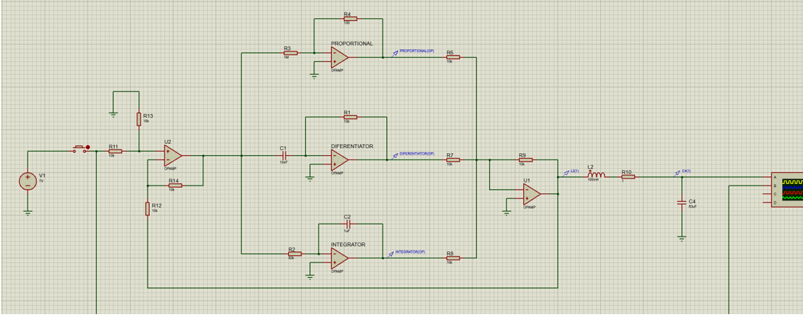
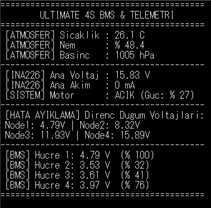
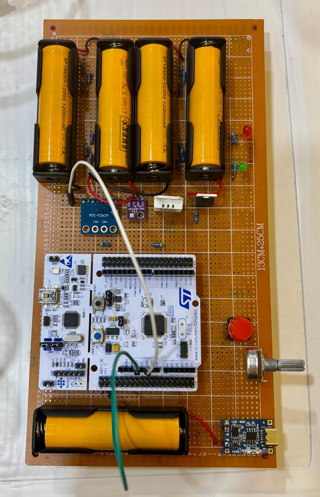

# 4S Li-Ion Battery Management System

This project was developed as part of the **EEE316 Microprocessors** course.  
The main objective of the project is to design and implement a basic **4-cell Li-Ion Battery Management System (BMS)** using a microprocessor-based control structure.

## Project Overview

The system focuses on monitoring a 4-cell Li-Ion battery pack and demonstrating the basic working principles of a battery management system. The project includes circuit design, Proteus simulation, terminal output observation, and physical hardware implementation on a pertinax board.

The circuit was first tested in Proteus, and then transferred onto a pertinax board to create a more permanent and organized prototype. This process helped combine theoretical knowledge with hands-on hardware experience.

## My Contribution

In this project, I was responsible for transferring the circuit onto the pertinax board and preparing the hardware implementation.

My contribution included:

- Component placement on the pertinax board
- Soldering and wiring connections
- Organizing the physical circuit layout
- Checking hardware connections
- Supporting the testing process with simulation and terminal outputs
- Preparing the circuit for demonstration

## Available Project Files

The shared materials in this repository include:

- Project poster
- Proteus simulation schematic
- Terminal output screenshot
- Top view of the pertinax board implementation

## Project Visuals

### Project Poster

[View Project Poster](4S_BMS_Project_Poster.pdf)

### Proteus Simulation

### Terminal Output

### Pertinax Board Top View

## Hardware Implementation

The hardware part of the project was transferred onto a pertinax board to make the circuit more stable and suitable for demonstration. This stage provided hands-on experience in soldering, wiring, component placement, and circuit organization.

The pertinax implementation helped improve the physical structure of the project compared to a temporary breadboard setup.

## Simulation and Testing

Proteus was used to simulate and observe the circuit behavior before and during the hardware implementation process. The terminal output was used to verify the system response and observe the monitored values.

This allowed us to compare the expected behavior of the circuit with the output observed during testing.

## Course Information

- **Course:** EEE316 Microprocessors
- **Project:** 4-Cell Li-Ion Battery Management System
- **Topic:** Battery Management System, Embedded Systems, Circuit Prototyping

## Technologies and Tools

- Microprocessor-based control structure
- Proteus simulation
- Terminal monitoring
- Pertinax board implementation
- Soldering and hardware prototyping

## Notes

This project was developed for educational purposes. It demonstrates the basic principles of a microprocessor-based battery management system.

It should not be used directly in high-power or commercial battery applications without further safety improvements, detailed protection circuits, and professional validation.
